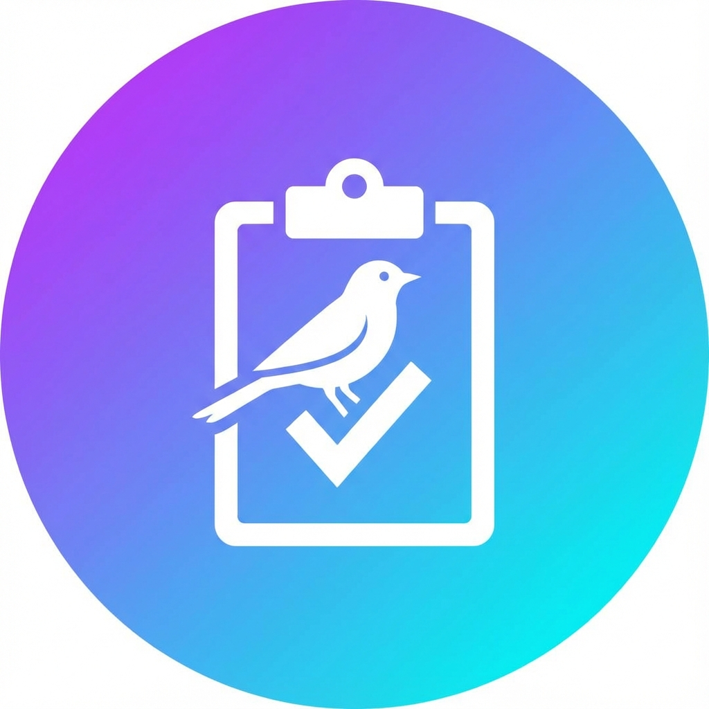

# Survey PWA - Environmental Survey Data Collection



A Progressive Web App (PWA) for collecting environmental survey data with offline-first capabilities and automatic synchronization to Google Sheets.

## ✨ Features

- 📱 **Progressive Web App** - Installable on mobile and desktop
- 🔌 **Offline-First** - Works without internet connection
- 💾 **IndexedDB Storage** - Local data persistence with Dexie.js
- 🔄 **Auto-Sync** - Background synchronization when online
- 🐦 **Species Autocomplete** - Smart species search with multi-select
- ⏱️ **Built-in Timer** - 5-minute countdown with auto-start
- 📊 **Google Sheets Integration** - Automatic data sync via Apps Script
- 🎨 **Modern UI** - Beautiful dark theme with glassmorphism effects

## 🚀 Quick Start

### 1. Clone or Download

```bash
git clone <your-repo-url>
cd survey_gtech_birds
```

### 2. Set Up Google Sheets Integration

1. Create a new Google Sheet for storing survey data
2. Open **Extensions > Apps Script**
3. Copy the code from `google-apps-script.js` and paste it
4. Click **Deploy > New deployment**
5. Choose **Web app** as deployment type
6. Set **Execute as**: Me
7. Set **Who has access**: Anyone
8. Click **Deploy** and copy the Web app URL
9. Update `config.js` with your URL:

```javascript
SHEETS_API_URL: 'YOUR_GOOGLE_APPS_SCRIPT_URL_HERE'
```

### 3. Deploy to GitHub Pages

1. Initialize Git repository (if not already done):

```bash
git init
git add .
git commit -m "Initial commit: Survey PWA"
```

2. Create a new repository on GitHub
3. Push your code:

```bash
git remote add origin <your-github-repo-url>
git branch -M main
git push -u origin main
```

4. Enable GitHub Pages:
   - Go to repository **Settings > Pages**
   - Select **Source**: Deploy from a branch
   - Select **Branch**: main, folder: / (root)
   - Click **Save**

5. Your app will be available at: `https://<username>.github.io/<repo-name>/`

### 4. Local Development

Simply open `index.html` in a web browser, or use a local server:

```bash
# Using Python
python -m http.server 8000

# Using Node.js
npx serve

# Using PHP
php -S localhost:8000
```

Then visit `http://localhost:8000`

## 📋 Form Fields

- **Record ID** - Auto-generated unique identifier
- **PC Location ID** - Point count location identifier
- **Date** - Day, Month, Year
- **Start Time** - Survey start time
- **Observer** - Observer name
- **Species** - Multi-select species (autocomplete)
- **Distance** - Distance in meters (optional)
- **Directions** - Cardinal directions (optional)
- **Observation Details** - Detailed observations (optional)
- **Notes** - Additional notes (optional)

## 🔧 Configuration

Edit `config.js` to customize:

```javascript
const CONFIG = {
  SHEETS_API_URL: 'your-apps-script-url',
  TIMER_DURATION_MS: 5 * 60 * 1000, // 5 minutes
  SYNC_RETRY_ATTEMPTS: 3,
  SYNC_RETRY_DELAY_MS: 2000,
  FEATURES: {
    AUTO_START_TIMER: true,
    BACKGROUND_SYNC: true,
    OFFLINE_MODE: true
  }
};
```

## 📱 Installing as PWA

### On Mobile (Android/iOS)

1. Open the app in your browser
2. Look for "Add to Home Screen" or "Install" prompt
3. Follow the installation steps
4. Launch from your home screen

### On Desktop (Chrome/Edge)

1. Open the app in Chrome or Edge
2. Click the install icon in the address bar
3. Click "Install"
4. Launch from your apps menu

## 🗄️ Data Storage

### Local Storage (IndexedDB)

All survey data is stored locally using IndexedDB via Dexie.js. This ensures:
- Data persists even when offline
- Fast local access
- Automatic sync queue management

### Cloud Storage (Google Sheets)

When online, data automatically syncs to your configured Google Sheet with columns:
- Record ID, PC Location ID, Day, Month, Year
- Start Time, Observer, Species
- Distance, Directions, Observation Details, Notes
- Timestamp

## 🔄 Offline Workflow

1. **Offline**: Fill out survey → Save locally to IndexedDB
2. **Online**: Automatic background sync to Google Sheets
3. **Status**: Check pending count in the status bar

## 🎨 Customization

### Species List

Edit `species.json` to add/modify species:

```json
[
  {
    "id": 1,
    "common_name": "Species Name",
    "scientific_name": "Scientific Name"
  }
]
```

### Styling

Edit `styles.css` to customize colors, fonts, and layout. The design system uses CSS custom properties for easy theming.

## 🛠️ Technology Stack

- **Frontend**: HTML5, CSS3, Vanilla JavaScript
- **Storage**: IndexedDB (Dexie.js)
- **PWA**: Service Workers, Web App Manifest
- **Backend**: Google Apps Script
- **Hosting**: GitHub Pages (HTTPS)

## 🔮 Future Enhancements

- 📸 Photo/audio capture
- 👤 User authentication
- 📈 Dashboard visualization
- 🗺️ GPS location tracking
- 🔄 Migration to Supabase/Firebase
- 📤 Export to CSV/JSON

## 📄 License

MIT License - feel free to use and modify for your needs.

## 🤝 Contributing

Contributions are welcome! Please feel free to submit issues or pull requests.

## 📞 Support

For issues or questions, please open an issue on GitHub.

---

**Built with ❤️ for environmental conservation**
